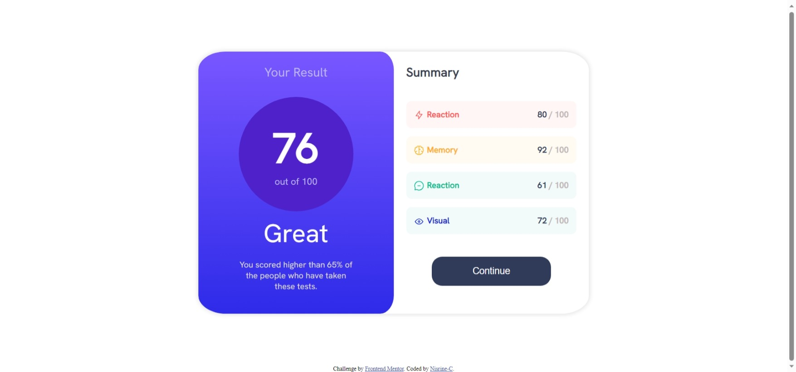
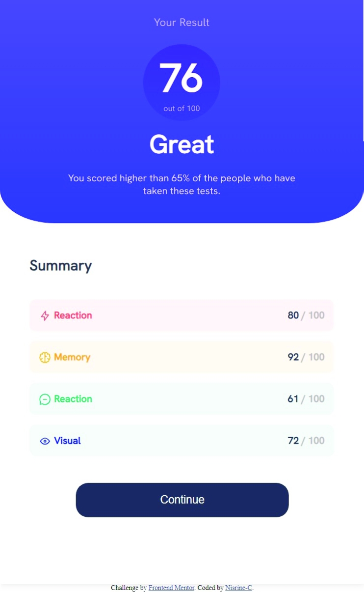

# Frontend Mentor - Results summary component solution

This is a solution to the [Results summary component challenge on Frontend Mentor](https://www.frontendmentor.io/challenges/results-summary-component-CE_K6s0maV). 

## Table of contents

- [Overview](#overview)
  - [Screenshot](#screenshot)
  - [Links](#links)
- [My process](#my-process)
  - [Built with](#built-with)
- [Author](#author)

## Overview

### Screenshot

-Desktop Screenshot:

-Mobile Screenshot:

### Links

- Solution URL: ([https://your-solution-url.com](https://www.frontendmentor.io/solutions/responsive-results-page-with-dynamic-data-loading-7_-zRZeSWW))
- Live Site URL: (https://nisrine-c.github.io/results-summary-component-solution-withpureCSS.github.io/)

## My process

### Built with

- Semantic HTML5 markup
- CSS custom properties
- Flexbox
- CSS Grid

## Author

- Website - [Nisrine C](https://nisrine-c.github.io/results-summary-component-solution-withpureCSS.github.io/)
- Frontend Mentor - [@Nisrine-C](https://www.frontendmentor.io/profile/yourusername)
